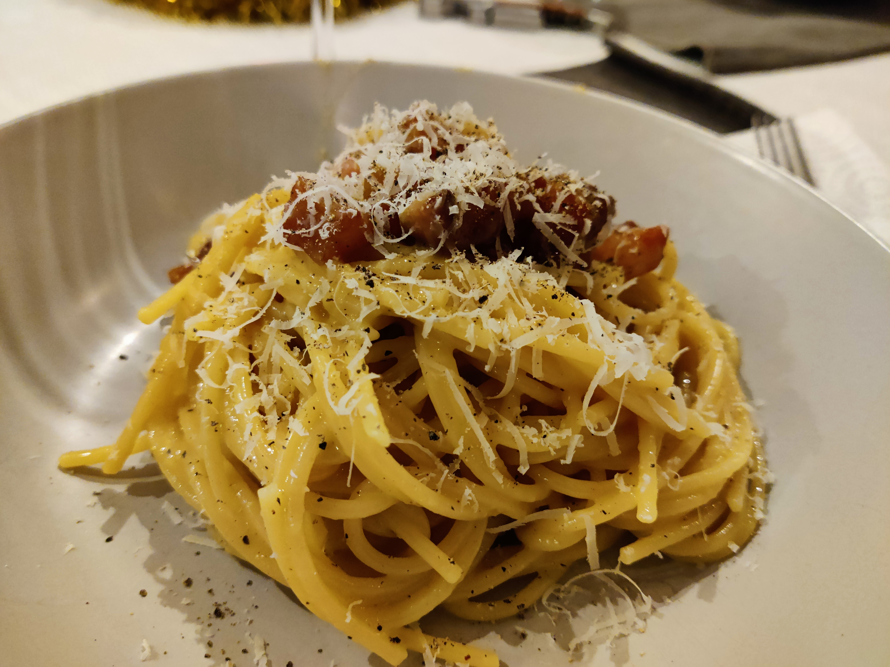

# Spaghetti alla Carbonara

## Ingredients

The ingredients and their amounts for one person are the following

- Spaghetti (preferably bronze extruded[^1]): 100g
- Eggs: 2
- Guanciale: 50g
- Parmigiano and/or pecorino[^2]: 30g
- Black pepper: ~5g

## Procedure

1. Cut the guanciale in cubes of ~1cm[^3].

1. Inside a metallic[^4] bowl add the **egg** yolks, the **cheese** and the **black pepper**, mix them with a balloon whisk, you should get a semi-solid dough texture.
2. Prepare two pots with water, one for boiling the pasta and another for putting the metallic bowl in a water bath.
   - For the pasta: 700ml of water, generous amount of salt and bring to boil.
   - For the water bath: a quantity of water that makes the water bath comfortable, heat until reaching 60-65ºC[^5].
3. Add the **spaghetti** to the boiling water.
4. Put the **guanciale** into a frying pan without any oil, use a heat setting high enough so the guanciale develops a crust but lower it if you see a lot of smoke coming out of it. Stir frequently and submerge it regularly in the liquid fat it is releasing, this will ensure an even cooking.
5. Put the metallic bowl under the water bath and mix again its content. Keep mixing until the semi-solid dough turns into a soft sauce.
6. When the **guanciale** has developed a hard crust and a caramelized color, turn of the heat and try to keep the liquid fat separated from the meat. This can be achieved by placing the pan in a flat, heat-resisting surface and putting a rag under one side of the pan.
7. Take a spoon of pasta water, let it chill for 10s in the spoon, add it to the metallic bowl and mix[^6].
8. Take a spoon of the guanciale fat, add it to the bowl and mix.
9. When the **spaghetti** have been boiling for the amount of time specified in the package to be cooked *al dente*, turn the heat off and take them directly from the pot to the bowl with tweezers. It is ok (and desired) if some of the water they carry falls inside the bowl.
10. Stir everything inside the bowl and ensure that the spaghetti is well integrated with the sauce
11. Add the **guanciale** to the bowl (without the fat it released) and mix well.

## Presentation

1. Roll the spaghetti inside the bowl with tweezers, with a big spoon at the end so they don't fall of. Put them in a deep plate (you will probably have to do this a couple of times to take all the spaghetti). 
2. Add the guanciale that didn't get carried away with the spaghetti on top.
3. Put a bit of grated parmigiano and black pepper on top
4. *Buon appetito!*

[^1]: Bronze extruded pasta, in contrast to teflon extruded pasta, releases more starch when boiled, which will help in any emulsion and make your sauces more creamy. It also has a rougher texture and sauces adhere better to it.
[^2]: I personally like to use 20g of parmigiano and 10g of pecorino, but sometimes I don't feel like buying pecorino and I use simply 30g of parmigiano.
[^3]: This is a good size to achieve a soft interior while maintaining a crunchy and caramelized crust. 
[^4]: It is not strictly necessary for it to be metallic, but since it will have to be put under a water bath, choose something made of a good thermal conductor. 
[^5]: Much higher temperatures will overcook the yolks, much lower will be like not doing anything. If you can't measure the temperature, bring the water to boil and let it cool down for 5 minutes.
[^6]: This will make the sauce creamier and raise a bit the temperature at which the mix would curdle, ensuring that we don't accidentally make an spaghetti tortilla when we add the hot spaghetti to the mix.

